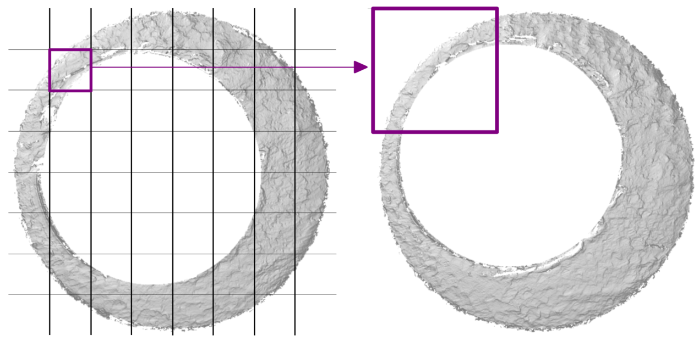

```{r setup, include=FALSE}
options(htmltools.dir.version = FALSE)
```

```{r, load_refs, include=FALSE, cache=FALSE}
RefManageR::BibOptions(check.entries = FALSE,
                       bib.style = "authoryear",
                       cite.style = "alphabetic",
                       style = "markdown",
                       max.names = 1,
                       no.print.fields = c("urldate","file","issn","url","keywords","language","abstract"),
                       hyperlink = FALSE,
                       dashed = FALSE)
myBib <- RefManageR::ReadBib("ref.bib", check = FALSE)
```

# Algorithmic Cartridge Case Comparisons

A general pipeline for comparing two cartridge case scans:

1. **Preprocess** the scans to highlight breech face impressions.

2. **Compare** the two scans and extract similarity features.

3. Formulate a **Decision Rule** to determine whether similarity features support the same-source hypothesis.

--

Comparison algorithms attempt to automate most, if not all, of this process.

- Many algorithms are currently described in prose rather than with code.

- Ambiguities in written-word descriptions render results unreproducible.

--

Reproducibility refers to using method/data from previous study and arriving at same results.

- Computational reproducibility requires *all* code and intermediate data be provided [(Peng, 2011)](https://www.jstor.org/stable/41352177?seq=1#metadata_info_tab_contents).

---

# Congruent Matching Cells (CMC) method

Algorithm developed at NIST to perform Comparison and Decision Rule steps:
 
1. Divide a reference scan into a grid of cells.
 
2. Determine where each reference cell aligns best (translation & rotation) in the target scan.

3. Identify if a consensus exists among these estimated alignment values.

4. Count number of cells with alignment values close to consensus.

```{r,echo=FALSE, fig.align='center',out.width="75%"}

```


---
# cmcR Package

- CMC method requires user to make many processing decisions.

- How sensitive is the method to different decisions?

  - Is there an "optimal" set of decisions?

--

- cmcR package provides a general framework for investigation:

 - `preProcess_*` functions perform initial processing
 
 - `comparison_*` functions extract similarity features
 
 - `decision_*` functions identify cells with alignment values close to consensus

- Each step is further divided into modularized pieces.

---
## Preprocessing Example

```{r, eval=FALSE}
fadul1.1 <- x3ptools::x3p_read("https://tsapps.nist.gov/NRBTD/Studies/CartridgeMeasurement/DownloadMeasurement/2d9cc51f-6f66-40a0-973a-a9292dbee36d")

fadul1.1 %>%
  preProcess_crop(region = "exterior",...) %>%
  preProcess_crop(region = "interior",...) %>%
  preProcess_removeTrend(...) %>%
  preProcess_gaussFilter(...)
```

```{r, fig.align='center',echo=FALSE,out.width="90%"}
knitr::include_graphics("images/preProcessDiagram.png")
```


---
## Comparison & Decision Rule Example

```{r, include=FALSE}
library(cmcR)
library(x3ptools)
library(magrittr)
library(dplyr)
```


```{r,include=FALSE,cache=TRUE}
fadul1.1_id <- "DownloadMeasurement/2d9cc51f-6f66-40a0-973a-a9292dbee36d"
# Same source comparison
fadul1.2_id <- "DownloadMeasurement/cb296c98-39f5-46eb-abff-320a2f5568e8"

# Code to download breech face impressions:
nbtrd_url <- "https://tsapps.nist.gov/NRBTD/Studies/CartridgeMeasurement/"

fadul1.1_raw <- x3p_read(paste0(nbtrd_url,fadul1.1_id))
fadul1.2_raw <- x3p_read(paste0(nbtrd_url,fadul1.2_id))

fadul1.1 <- fadul1.1_raw %>%
  preProcess_crop(region = "exterior",
                  radiusOffset = -30) %>%
  preProcess_crop(region = "interior",
                  radiusOffset = 200) %>%
  preProcess_removeTrend(statistic = "quantile",
                                 tau = .5,
                                 method = "fn") %>%
  preProcess_gaussFilter() %>%
  x3ptools::sample_x3p()

fadul1.2 <- fadul1.2_raw %>%
  preProcess_crop(region = "exterior",
                  radiusOffset = -30) %>%
  preProcess_crop(region = "interior",
                  radiusOffset = 200) %>%
  preProcess_removeTrend(statistic = "quantile",
                                 tau = .5,
                                 method = "fn") %>%
  preProcess_gaussFilter() %>%
  x3ptools::sample_x3p()
```
```{r,include=FALSE}
comparisonData <- comparison_allTogether(reference = fadul1.1,
                                         target = fadul1.2,
                                         theta = -24, #degrees
                                         numCells = 64)
comparisonData <- comparisonData %>%
  mutate(originalMethodClassif = decision_CMC(cellIndex,x,y,theta,pairwiseCompCor))
plt <- cmcPlot(fadul1.1,fadul1.2,
        reference_v_target_CMCs = comparisonData,
        x3pNames = c("Fadul 1-1","Fadul 1-2"))
```


```{r,eval=FALSE}
comparisonData <- comparison_allTogether(reference = fadul1.1,
                                         target = fadul1.2,
                                         theta = -24, #degrees
                                         numCells = 64) #8x8 grid
comparisonData <- mutate(comparisonData,
                         originalMethodClassif = decision_CMC(cellIndex,x,y,theta,pairwiseCompCor))
cmcPlot(fadul1.1,fadul1.2,
        reference_v_target_CMCs = comparisonData)
```
```{r,echo=FALSE,fig.align="center"}
plt$CMCs +
  ggplot2::theme(plot.margin = ggplot2::margin(-7.5,0,0,0,"cm"))
```


---
# Conclusions

- Algorithms used to compare forensic evidence should never be "black boxes." They deserve scrutiny.

 - Reproducibility is often taken for granted.

--

- Communicating a method's sensitivity to different processing conditions is vital.

- Scientific exploration and discovery is accelerated when a method is modularized into easily understood steps.

--

- cmcR package provides modularized, open-source tools for algorithmically comparing cartridge case scans.

---
class: center, middle

#Thank You!

.footnote[
[cmcR Website](https://github.com/CSAFE-ISU/cmcR), 
[Slides](https://jzemmels.github.io/cmcR_presentation/cmcR_presentation.html#1)
]
---
# References

```{r refs1, echo=FALSE, results="asis"}
RefManageR::NoCite(myBib,1:5)
RefManageR::PrintBibliography(myBib)
```
